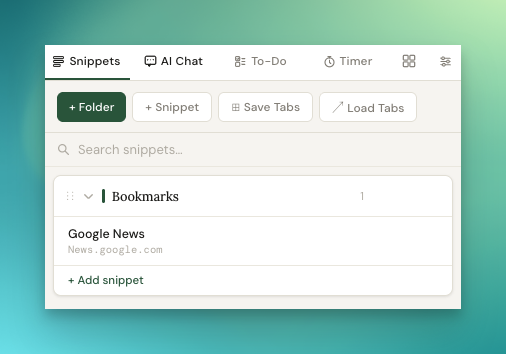
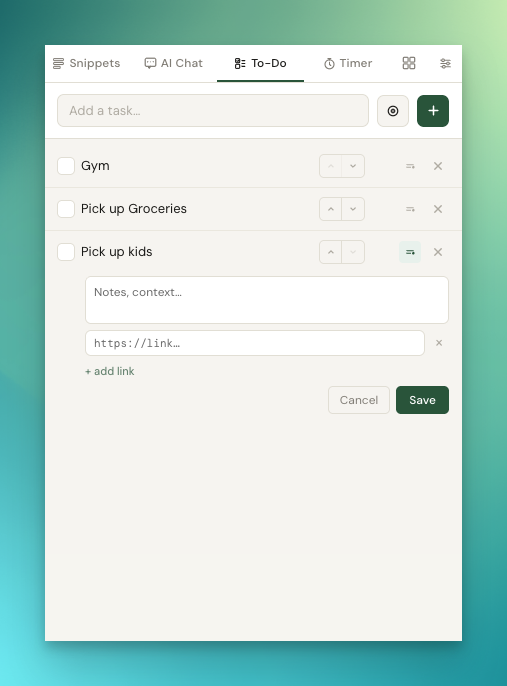
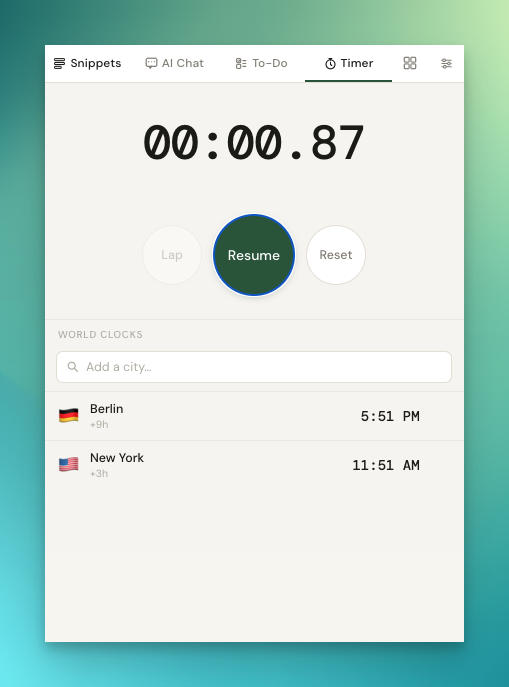

# Jeeves Chrome Extension

A Chrome extension built as a personal dev assistant. Lives in the browser toolbar and handles the small recurring tasks that add up — snippets, todos, Linear tickets, port monitoring, timers, and more.

---

## Features

**Snippets** — Save and instantly copy text snippets. Organize them in folders (manually ordered, draggable) or keep them loose (auto alpha-sorted). Drag loose snippets into folders. Full-text search across all content.

**To-Do** — Lightweight task list. Paste a URL and it auto-fetches the page title. Reorder tasks with up/down buttons. Pin any task to a floating always-on-top desktop window. Clear completed items in one click.

**Linear** — Describe a ticket in plain English (or by voice), and OpenAI drafts the title, description, priority, and project assignment. Preview before creating. Requires OpenAI + Linear API keys.

**Chat** — Quick AI chat backed by OpenAI, inline in the popup.

**Ports** — Monitors local dev servers. Configurable list of ports; shows which are live.

**Timer** — Simple countdown/stopwatch.

**Files** — Quickly create files with any extension.

---

## Screenshots







---

## Setup

This extension is sideloaded directly from the source code — it's not listed on the Chrome Web Store. That means you install it manually in developer mode, which takes about 30 seconds.

1. Clone or download this repo
2. Open Chrome and go to `chrome://extensions`
3. Toggle on **Developer mode** (top-right corner)
4. Click **Load unpacked** and select the repo folder
5. The extension will appear in your toolbar — pin it for easy access

**API keys (optional):**
- Open the extension and go to the **Settings** tab
- Add an OpenAI key to use the Chat tab and Linear ticket generation
- Add a Linear API key, then click **Test connection** to fetch your teams

---

## Data & Privacy

All data is stored locally in `chrome.storage.local` (5MB limit) — nothing is sent anywhere except:
- OpenAI API (when using Linear ticket generation or Chat)
- Linear API (when creating tickets)
- YouTube oEmbed / page HTML (when fetching titles for pasted URLs in To-Do)

No analytics, no tracking, no backend.

---

## Generating Icons

If you need to regenerate the icons:

```
node create_icons.js
```

---

## Permissions

| Permission | Why |
|---|---|
| `storage` | Saves snippets, todos, settings locally |
| `clipboardWrite` | Copies snippets to clipboard on click |
| `downloads` | File tab functionality |
| `windows` | Opens pinned floating todo windows |
| `host_permissions: <all_urls>` | Fetches page titles when a URL is pasted into To-Do |
| `api.openai.com`, `api.linear.app` | AI and Linear integrations |
| `localhost/*` | Monitors local dev server ports |

---

## Stack

Vanilla JS, HTML, CSS — no build step, no frameworks. Chrome Extension Manifest V3.

Fonts: [Lora](https://fonts.google.com/specimen/Lora), [DM Sans](https://fonts.google.com/specimen/DM+Sans), [DM Mono](https://fonts.google.com/specimen/DM+Mono)
